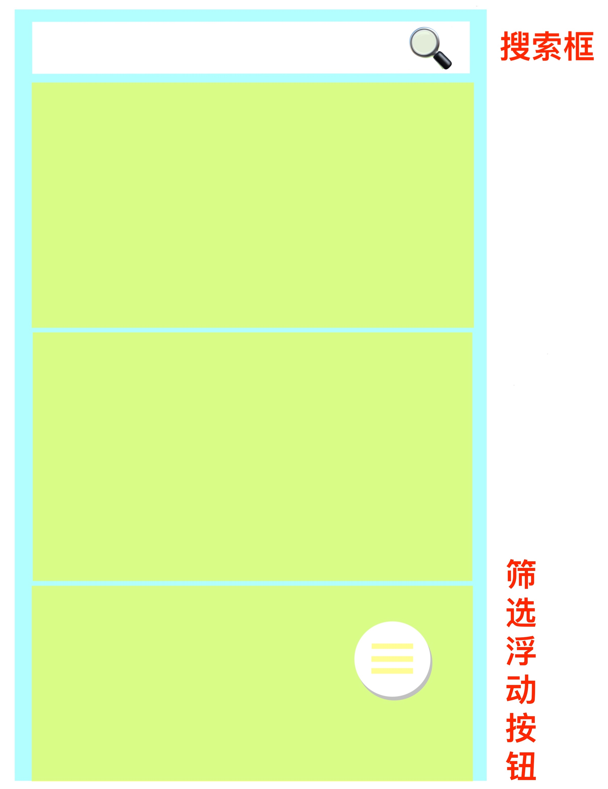

# E-Three-Kingdom

> 2017-10-29 20:26
>
> It is an android app of E-dictionary for the romance of three kingdom
>
> It also is our mid-term project

- Group Info:

| Teammate | Name         |
| -------- | ------------ |
| 1        | ZhanZongYuan |
| 2        | ZhangJiaQiao |
| 3        | ZhangHanWei  |

 

[TOC]

 

## 中文版项目说明

> 这是一个三国辞典安卓应用

### 1. 应用基本功能介绍

#### 1.1 查询功能

- 八大三国关键条目查询：
  - **三国人物**
    - *本辞典收录三国演义和三国志中出现的所有人物，全部做了全文索引，详尽提供了多样的个人数据供查询。此外，更具有强大的多人数据对比功能。*
    - **多级信息筛选查询功能**
    - **直接输入搜索功能**
  - **收藏夹**
  - 演义章节*（待开发）*
  - 三国战争*（待开发）*
  - 三国计谋*（待开发）*
  - 三国事件*（待开发）*
  - 三国地名*（待开发）*
  - 三国官爵*（待开发）*

#### 1.2 词条增删改查功能

#### 1.3 即时笔记添加功能

- 在查看词条时，用户可以编辑添加自己的心得体会，当再次查看这条词条时就可以看到自己之前的理解

#### 1.4 词条收藏以及查看收藏功能

- 为每个用户保存喜欢的或者希望下次再次查看的词条，方便下次及时查看自己的查看过的信息

#### 1.5 扩展

- 历史记录查看
- 人物背景音乐

 

### 2. 预期应用界面

#### 2.1 主界面

- 功能：相关八大功能选择进入（包括**三国人物**）
- 预期界面效果如下：

*主界面(from: https://github.com/Ramotion/cardslider-android)*

- 基本交互：
  - 点击某一希望获取的信息卡片，如：点击”三国人物“卡片进入二级界面

#### 2.2 二级信息列表界面

- 基本功能：
  - 显示多个词条
  - 词条关键词查询
    - 顶部搜索框
  - 词条分类筛选
    - 实现：点击浮动按钮弹出筛选对话框
  - 词条详情
    - 添加笔记功能
    - 收藏功能

- 预期词条卡片界面效果如下*（缺搜索框即浮动按钮）*：

*词条卡片界面(from: https://github.com/Yalantis/Euclid)*

> 优点：
>
> - 界面简洁优美
> - 有流畅的界面动画
> - 满足字典人物简介的各个基本功能

- 词条卡片界面搜索框，浮动筛选按钮设计草稿：

点击浮动按钮后，弹出筛选界面对话框如下：

- 预期详情界面如下：

*人物详情功能按钮扩展(from: https://github.com/Yalantis/Context-Menu.Android)*

> 因为功能需求，我们需要提供一些如编辑等功能，这时候我觉得不能在人物详情上进行操作，而应该提供独立的按钮，如果需要就开启另一个界面进行操作

- 基本交互
  - 长按词条卡片弹出对话框询问是否删除词条
  - 点击搜索框搜索内容
  - 点击浮动按钮弹出筛选信息对话框
    - 选择过滤选项
    - 添加自定义词条
  - 点击词条卡片弹出词条详情
  - 点击详情界面的小菜单按钮弹出更多功能项
    - 收藏
    - 评论
    - 修改词条内容

 

### 3. 技术细节实现

- 数据存取
  - 创建人物信息类Character，包含人物的头像、姓名、性别、生卒年月、籍贯、主效力等信息
  - 使用sqlite将数据保存到应用本地数据库中，创建DataBaseHelper类管理数据库的增删改查
  - 在DataCardActivity时，当搜索或筛选后调用DataBaseHelper读取数据库，并过滤得到最终数据
- Activity界面
  - MainActivity 主界面
  - DataCardActivity 二级界面（词条卡片&词条详情）
- UI界面及动画模仿以下模板库
  - 主功能界面模板：https://github.com/Ramotion/cardslider-android
  - 词条卡片界面模板：https://github.com/Yalantis/Euclid
  - 词条详情功能按钮模板：https://github.com/Yalantis/Context-Menu.Android

 

### 4. 分工内容

| 组员   | 内容                                     |
| ---- | -------------------------------------- |
| 詹宗沅  | 1. 项目搭建  2. 主界面  3. 协助搭建二级界面 |
| 张家侨  | 1. 二级建模搭建                         |
| 张涵玮  | 1. 数据库功能实现 实现数据库的增删改查接口      |

 

### 5. 项目功能完成进度⏳⏳⏳

- [ ] 查询功能⏰

- [ ] 词条增删改查功能⏰

- [ ] 即时笔记添加功能⏰

- [ ] 词条收藏以及查看收藏功能⏰

- [ ] 历史记录查看⏰
- [ ] 人物背景音乐⏰